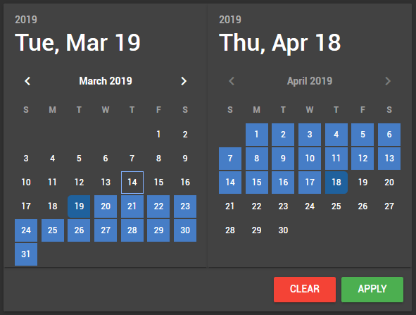
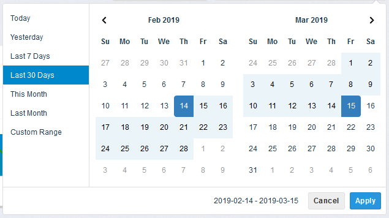
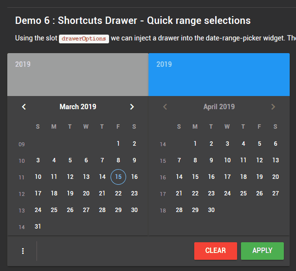
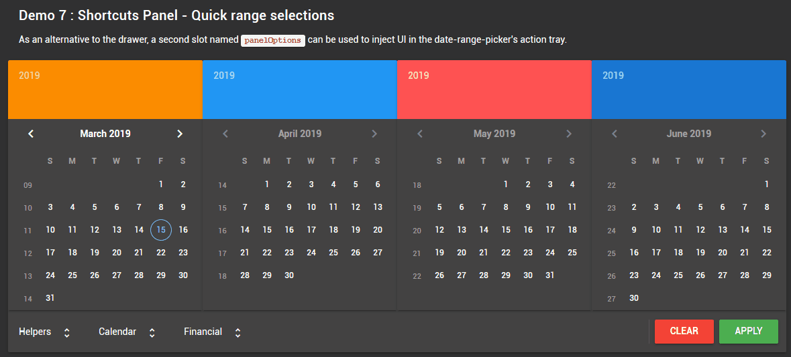
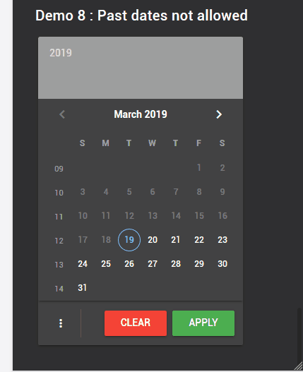

# Vuetify date-range-picker
A date range picker based on [Vueitfy](https://vuetifyjs.com) 

## API

### Props
| Name                      | Default           | Type              | Description                           |
|---------------------------|-------------------|-------------------|---------------------------------------|
|**allow-back-in-time**     | true              | Boolean           | Instructs range-picker to allow range  selection that are earlier than today.
|**auto-hide**              | false             | Boolean           | Selecting the range start and end dates  in the same month reduces the picker  count to one focused on that month
|**auto-focus**             | false             | Boolean           | Setting auto-focus instructs the picker  to focus the range start date in the master  picker.
|**auto-size**              | false             | Boolean           | Setting auto-hide reduces the picker count  based on the screen size. This is especially  important on mobile screens.
|**color**                  | null              | Array             | Extends the date-picker color property by  accepting an array of strings that can  correspond to the number of pickers.
|**header-color**           | []                | Array             | Extends the date-picker head-color property  by accepting an array of strings that  can correspond to the number of pickers.
|**hide-disabled**          | false             | Boolean           | Hide disabled navigation icons
|**is-drawer-open**         | false             | Boolean           | Controls visibility of the options drawer.  Has effect only if the <code>optionsDrawer</code> slot is  populated. Make sure to bind the same data  element to both the date-range-picker  and the date-range-drawer.
|**live-update**            | false             | Boolean           | If enabled, the component will upate its  model as the user makes selections.
|**max-width**              | null              | Number            | Default behavior of the picker widget is  to display pickers in a row. Adjusting  <code>max-width</code> will cause the row to wrap.
|**mode**                   | 'fuzzy'           | String            | When <code>allow-back-in-time</code> is disabled,  this controls the logic for rejecting date  selections. Applies only with `shortcuts`  as the UI is blocked from selecting past dates.  *See below for more information*
|**num-pickers**            | 2                 | Number            | Controls the number of date-pickers displayed  within the date-range-picker interface.
|**multi-range**            | false             | Boolean           | **TODO**: Controls the ability to select multiple  date ranges. This functionality is required  when comparing dates such as Q1 and Q2  or W13 with W13 of previous year.
|**range-colors**           | null              | Array             | **TODO**: When multi-range is enabled, controls  the colors used to highlight selected ranges.
|**reset-view-on-clear**    | true              | Boolean           | Controls picker focus date when the  date-range-picker is cleared. If enabled,  the picker will focus to the start-date  (if set) or today's date.
|**start-date**             | null              | String | Date     | Controls the start date of the date-range-picker.  Ignored if the date is in the past and  allow-back-in-time is disabled.

### Events
| Name                      | Payload                               | Description                           |
|---------------------------|---------------------------------------|---------------------------------------|
| input                     | Array of strings                      | Bind to a function to process the range  set by the user.|
| update                    | Array of strings                      | Bind to a function to process live updates.|
| update:pickerDate         | String                                | Handle changes to the date-picker mode.  Should bind `picker-date` to a local  data property to enable proper  view resets.|
| update:pickerVisible      | Boolean                               | Event fired when the user hides the picker drawer.|

### Options Events
| Name                      | Payload                               | Description                           |
|---------------------------|---------------------------------------|---------------------------------------|
| info                      | String                                | Applicable to included implementation of the `optionsDrawer` and `optionsPanel`.  Message based on date user selected.|
| warning                   | String                                | Applicable to included implementation of the `optionsDrawer` and `optionsPanel`.  Warning message based on date user selected.|
| error                     | String                                | Applicable to included implementation of the `optionsDrawer` and `optionsPanel`.  Error message based on date user selected.|

### Package Contents
In addition to the VDateRangePicker component, this package includes a shortcut drawer and panel  implementation as well as some mixins that may be useful depending on the application.

| File name                 | Location                               | Description                          |
|---------------------------|----------------------------------------|--------------------------------------|
| DateRangePicker           | src\components\DateRangePicker.vue     | Implements VDateRangePicker component  Import the component globally or locally |
| DateRangeDrawer           | src\components\DateRangeDrawer.vue     | Implements shortcut drawer for use in  `optionsDrawer` slot |
| DateRangePanel            | src\components\DateRangePanel.vue      | Implements shortcut panel for use in  `optionsPanel` slot |
| DateHelper                | src\mixins\DateHelper.js               | Helper for your application that provides  useful functions to manipulate dates.  *See below for more information.*
| DateRangeEvents           | src\components\mixins\DateRangeEvents.js | Mixin for shortcut events. |
| DateRangePlugin           | src\components\mixins\DateRangePlugin.js | Mixin that provides logic for shortcut  click handlers. |
| DateRangeShortcutsFinance | src\components\mixins\DateRangeShortcutsFinance.js | Defines shortcuts and associated actions.  DateRangePanel and DateRangeDrawer  wraps this base file.  *See below for more information.* |
| DateAPI                   | src\components\mixins\DateAPIs\DateAPI.moment.js | Mixin that encapsulates external date  library for base functions. Package  contains an implementation using  [moment.js](https://momentjs.com/) and [days.js](https://github.com/iamkun/dayjs) 

### Dependencies
| Package                   | Purpose                                                                       |
|---------------------------|-------------------------------------------------------------------------------|
| [Vuetify DateRange](https://vuetifyjs.com/en/components/date-pickers) | The base VDateRangePicker extends Vuetify's VDateRange components             |
| [vue-responsive-components](https://github.com/Kelin2025/vue-responsive-components) | Implements resize observer for vue components. This is required to properly  handle screen resizing.|

## Installation and Usage

### Installation
    yard add vuetify-daterange-selector</code>

    OR

    nmp install --save vuetify-daterange-selector</code>

### Install as a Plugin

    // main.js
    import VDateRangePicker from "vuetify-daterange-selector"
    Vue.use(VDateRangePicker)

### Import in Components

    

### Usage

    <template>
        <v-date-range-picker v-model="dates"></v-date-range-picker>
    </template>
    

### Localization
The date-range picker requires loading for language files and does not have any fallback mechanism if the  
language strings are missing.

To accomplish this simply import the language files as per the [Vuetify documenation](https://vuetifyjs.com/en/framework/internationalization#internationalization)  : 

    //main.js

    /** Language files */
    import en from './components/lang/en.js'  //required
    import fr from './components/lang/fr.js'

    Vue.use(Vuetify, {
        lang: {
            locales: { en, fr },
        }
    })

## Shortcuts
It is customary with date-range pickers to provide extra UI that offers shortcuts for range selection such  
as `this week`, `last week` and `last month`. The purpose is to provide one-click shortcuts to frequently  
used date ranges.  Typically these shortcuts would extend the required size of the date picker by adding a  
seperate section such as this implementation:

To accomplish this, the date-range-picker component implements two slots named `drawerOptions` and `panelOptions`. 
Instead of occupying precious pixel real estate for the shortcut controls, this date-range-picker attempts to offer
the same functionality that users have come to expect with the following scheme: 

- drawerOptions: The draawerOptions slot, as the name suggests, adds a temporary drawer to the date-range-picker UI.

    <i>When the is slot is populated, the UI automatically displays a button in the action tray to activate the drawer.</i>

- panelOptions: The panelOptions slot on the other hand adds controls right-justified within the action tray. 

    <i>The panel displays component sets within horizontal expansion panels that are useful in reducing the amount for 
    horizontal space for large component sets.</i>

The panel offers a more streamlined interface for shortcuts but requires sufficient space in the action tray. The drawer<
works nicely within a single picker layout (for example on mobile) but requires a few more clicks to access.

## Shortcut implementation
In adition to the `VDateRangePicker` component, this package also includes `VDateRangeDrawer` and `VDateRangePanel` components. These components are esentially **UI builders** that parse an object to create the UI and associate actions to click events (essentially calls functions by name).

**Note**: Please note that the VDateRangeDrawer and VDateRangePanel components are example implemenations built on the idea of a simple UI builder.  The developer is free to ignore these components and provide a more streamlined implemenation with hardcoded component and event handlers. 

Since requirements for shortcuts vary greatly for every project the objective is to:

- Break-out the implementation for shortcuts from the base date-range component
- Make it easy to extend functionaltiy without needing to repeat past implementations (copy/paste)
- Maximize code re-use by seperating concerns such as isolating base date functions,  and date manipulation functions from the definition of shortcuts.

### Definining shortcuts
Taking a quick look at the `DateRangeShortcutsFinance.js` file we can quickly gather an understanding of how shortcuts are implemented.

We want to support the following types of shortcuts:
- Grouped shortcuts: Creates a button group; object types must be `v-btn`; subsequent actions overwrite previous actions
- Individual shortcuts: Creates any Vuetify component based on setting the object type; subsequent actions overwrite previous actions
- Linked shortcuts: Creates any Vuetify component based on setting the object type; ability to reference value of another component in click event handler

The DateRangeShortcutsFinance.js file is a mixin meant to be imported by the component that will be inserted in one of the scoped slots. In the base implemenation that would be the components `VDateRangeDrawer` and `VDateRangePanel`. This file implements a data array named `pickerOptions` which is parsed by the vue template.  The array is defined as follows:

One or more objects describing the component set:

| Element       | Type          | Default   | Description                               
|---------------|---------------|-----------|-------------------------------------------                
| groupModel    | Any           | null      | Optional; for grouped component sets      
| icon          | String        | none      | Optional; used in the drawer component only 
| show          | Boolean       | none      | Required; Component model; controls expansion state
| title         | String        | none      | Text identifying the component set         
| visible       | Boolean       | true      | Required; Visiblity of component set
| type          | String        | none      | Set to `'group'` for button groups        

Each object should contain one or more objects defined as follows:

| Element       | Type          | Default   | Description                               
|---------------|---------------|-----------|-------------------------------------------
| action        | String        | none      | Required; Name of function to invoke when component  changes
| icon          | String        | none      | Optional; Component icon                                     
| if            | String        | none      | Optional; Availability test; validates if component  should be visible
| items         | String        | none      | Optional; for components that support items  (example: v-select); function name returning list to display. 
| label         | String        | none      | Optional; for components that have a label property
| loading       | Boolean       | false     | Optional; Applies to components that have a loading state such as a button
| multiple      | Boolean       | none      | Optional; for components that support multiple selections
| needs         | String        | undefined | Reference to component who's value is required in the  event handler
| ref           | String        | undefined | Set the reference name of this component; required only  if its value is required in an action defined in another  component
| title         | String        | none      | Text describing the selection
| type          | String        | none      | Name of Vuetify component to create
| value         | Any           | none      | Optional; base value or component model

## Shortcuts combined with the `allowBackInTime` prop

Providing a date-range picker with range selection shortcuts while disallowing past dates *can* become problematic. To help compose with this configuration without reverting to implementing multple shortcut components, date-range picker provides the following functionality:

### 1 - Evaluate selection before applying
The base implementation includes a trivial rejection test mechanism via the optional property `if` which instructs the component to: 
(a) evaluate if the shortcut should be included in the list 
(b) evaluates if the range selected should be applied or ignored

    pickerOptions: [
        {
            ...define group
            options: {
                ...
                if: 'rangeIsNotPast',  <===== validate before applying date range
            }
        }
    ]

### 2 - Evaluation `Mode`
In certain situations, a shortcut, even if it contains past dates may still be desired.  For example, a shortcut for `this week` would fail if selected on a Wednesday since the week starts on Sunday and therefore contains past dates. One way to handle these situations is to provide means to control the logic for rejecting date selections. This is were the `mode` property comes into play.  The mode property dictates what should happen when the evaluate function fails. 

Mode can be set to `'strict'`, `'fuzzy'`, or `'lazy'` with the following effects:

| Mode          | Date range test 
|---------------|-------------------
| Strict        | Date range is reset if any of the trivial reject rules fail
| Fuzzy         | Only the last user selection is tested against the current date.  If the current date falls within or before, it will be allowed or  else [only] the last selection will be rejected  preserving the previous range settings
| Lazy          | Date range as per the last user selection will be tested against the  current date. If the date falls within, the range will be allowed;  else the range will be rejected.

### Evaluation Mode Examples

**Note:** *All psuedo code*

### 1 - Shortcuts that do not support multi-select

Strict mode:

    // today is February 12, 2019
    
    let range = ['2019-01-01','2019-01-28'];
    this.setDateRange(range); //fail

    let range = ['2019-02-10','2019-02-16'];
    this.setDateRange(range); //fails because the range includes a past date
    
    return this.dateRange; //empty array []

Fuzzy mode:

    // today is Febrary 12, 2019

    let range = ['2019-01-01','2019-01-28'];
    this.setDateRange(range); //fail

    let range = ['2019-02-10','2019-02-16'];
    this.setDateRange(range); //passes because the current date is within the range
    
    return this.dateRange; // ['2019-02-10','2019-02-16']

Lazy mode:

    // today is Febrary 12, 2019

    let range = ['2019-01-01','2019-01-28'];
    this.setDateRange(range); //fail

    let range = ['2019-02-10','2019-02-16'];
    this.setDateRange(range); //passes because the current date is within the range
    
    return this.dateRange; // ['2019-02-10','2019-02-16']

### 2 - Shortcuts with multi-select enabled

Strict mode:

    // today is February 12, 2019
    
    let range = []

    range.push('2019-01-01','2019-01-28');
    this.setDateRange(range); //fail, range is now []

    range.push('2019-02-10','2019-02-16');
    this.setDateRange(range); //fails because the range includes a past date

    range.push('2019-02-10','2019-02-16','2019-02-17','2019-02-23');  //this will be evaluated as ['2019-02-10','2019-02-23']
    this.setDateRange(range); //fails
    
    return this.dateRange; //empty array []

Fuzzy mode: 

    // today is February 12, 2019
    
    let range = []

    range.push('2019-01-01','2019-01-28');
    this.setDateRange(range); //fail, range is now []

    range.push('2019-02-17', '2019-02-23');
    this.setDateRange(range); //pass, range is now ['2019-02-17', '2019-02-23']

    range.push('2019-01-01','2019-01-28');
    this.setDateRange(range); //fail, range is still ['2019-02-17', '2019-02-23']
                              //in strict mode this would reset the range

    range.push('2019-02-10','2019-02-16'); //range is now ['2019-02-10', '2019-02-23']
    this.setDateRange(range); //pass
    
    return this.dateRange; //['2019-02-10', '2019-02-23']

Lazy mode:

    // today is February 12, 2019
    
    let range = []

    range.push('2019-01-01','2019-01-28');
    this.setDateRange(range); //fail, range is now []

    range.push('2019-02-17', '2019-02-23');
    this.setDateRange(range); //pass, range is now ['2019-02-17', '2019-02-23']

    range.push('2019-01-01','2019-01-28'); //range is now ['2019-01-01', '2019-02-23']
    this.setDateRange(range); //pass,

    range.push('2019-02-10','2019-02-16'); //range is still ['2019-01-01', '2019-02-23']
    this.setDateRange(range); //pass
    
    return this.dateRange; //['2019-01-01', '2019-02-23']